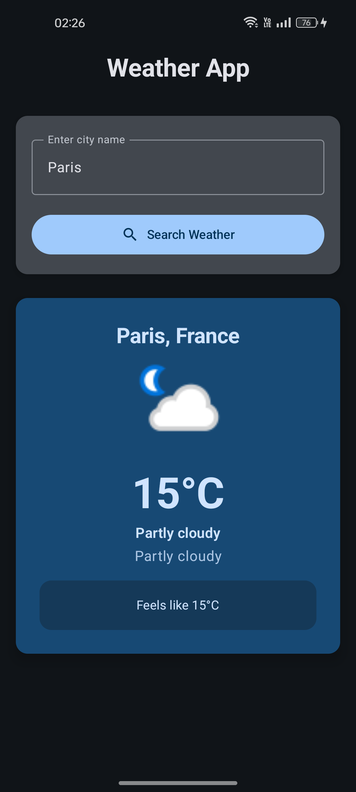
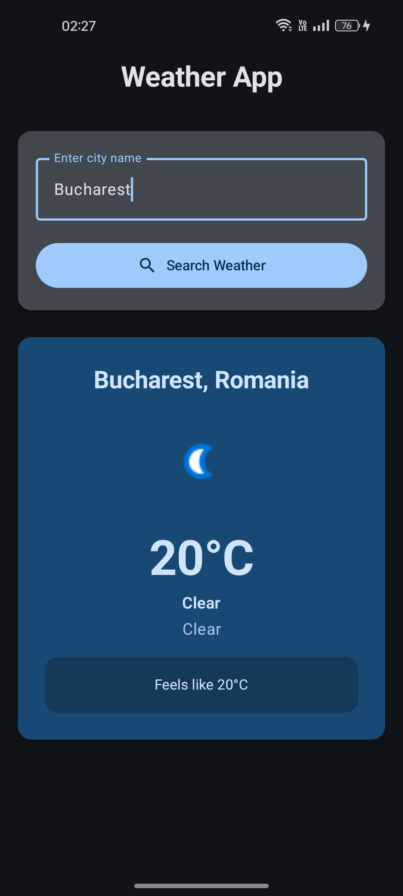
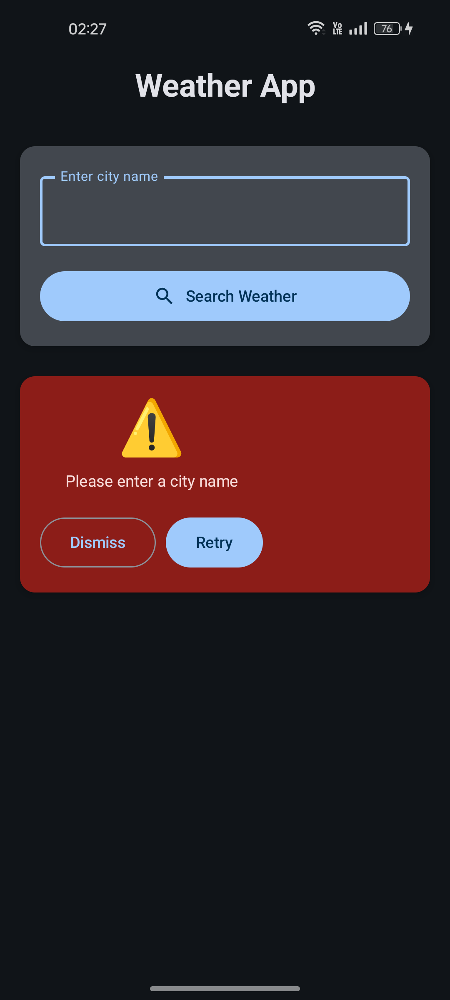
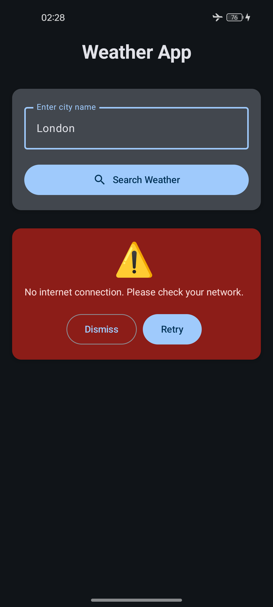
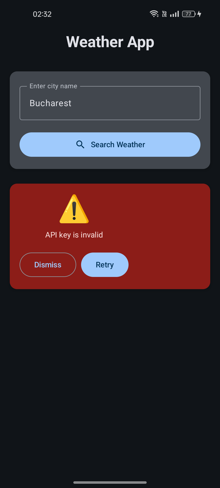

# Mini Weather App - Complete Setup Guide

## Project Overview

This is a modern Android weather application built with **Clean Architecture**, **MVVM pattern**, **Jetpack Compose**, **Hilt DI**, and **Retrofit**. The app fetches weather data from WeatherAPI.com and displays it in a user-friendly interface.

## Architecture

### Clean Architecture Layers:

1. **Data Layer** (`data/`)
   - API models, network calls, repository implementations
   - Data sources (API, DataStore)

2. **Domain Layer** (`domain/`)
   - Business logic, use cases, repository interfaces
   - Core models that represent business entities

3. **Presentation Layer** (`presentation/`)
   - UI components, ViewModels, UI state management
   - Jetpack Compose screens and components

## Project Structure

```
app/src/main/java/com/example/mini_weather_app/
├── data/
│   ├── model/              # API response models
│   ├── remote/             # API service and client
│   └── repository/         # Repository implementation
├── domain/
│   ├── model/              # Business models
│   ├── repository/         # Repository interface
│   └── usecase/            # Business logic use cases
├── presentation/
│   ├── weather/            # Weather screen and ViewModel
│   └── components/         # Reusable UI components
├── di/                     # Dependency injection modules
└── ui/theme/               # App theming
```

## Setup Instructions

### 1. API Key Configuration

1. Go to [WeatherAPI.com](https://www.weatherapi.com/) and create a free account
2. Get your API key from the dashboard
3. Open `data/remote/WeatherApi.kt`
4. Replace `"your_weatherapi_key_here"` with your actual API key:

```kotlin
private const val API_KEY = "your_actual_api_key_here"
```

### 2. Dependencies Installation

The `build.gradle.kts` file already includes all necessary dependencies:

- **Hilt** for dependency injection
- **Retrofit** for network calls  
- **Jetpack Compose** for modern UI
- **DataStore** for storing preferences
- **Coil** for image loading
- **Coroutines** for asynchronous programming

### 3. File Structure Setup

Create the following package structure and add the provided files:

#### Data Layer Files:
- `data/model/WeatherResponse.kt` - API response models (WeatherAPI.com format)
- `data/remote/WeatherApi.kt` - API interface (WeatherAPI.com endpoints)
- `data/remote/ApiClient.kt` - Retrofit configuration
- `data/repository/WeatherRepositoryImpl.kt` - Repository implementation

#### Domain Layer Files:
- `domain/model/WeatherInfo.kt` - Business models
- `domain/repository/WeatherRepository.kt` - Repository interface
- `domain/usecase/GetWeatherUseCase.kt` - Weather fetching use case
- `domain/usecase/GetLastSearchedCityUseCase.kt` - Last city retrieval
- `domain/usecase/SaveLastSearchedCityUseCase.kt` - City saving use case

#### Presentation Layer Files:
- `presentation/weather/WeatherViewModel.kt` - ViewModel with state management
- `presentation/weather/WeatherScreen.kt` - Main weather screen
- `presentation/weather/components/WeatherInfoCard.kt` - Weather display card

#### DI Files:
- `di/AppModule.kt` - Hilt dependency injection modules
- `di/MiniWeatherApp.kt` - Application class


## Features Implemented

### Core Requirements
- [x] Text input for city name
- [x] Search button functionality
- [x] Weather information display (city, temperature, condition, icon)
- [x] WeatherAPI.com integration (1M free calls/month)
- [x] Clean Architecture with MVVM
- [x] Jetpack Compose UI
- [x] Error handling for network failures and invalid cities
- [x] Loading states with progress indicators

### Aditional Features
- [x] **Loading States**: Beautiful loading animations and shimmer effects
- [x] **Data Persistence**: Last searched city saved using DataStore
- [x] **Unit Tests**: Unit tests for ViewModel and Repository
- [x] **Modern UI**: Material 3 design with cards, proper spacing, and animations
- [x] **Error Recovery**: Retry functionality and proper error messaging
- [x] **Image Loading**: Weather icons loaded with Coil library

## Testing

The project includes unit tests for:

### ViewModel Tests (`WeatherViewModelTest.kt`)
- Input validation
- State management
- Success and error scenarios
- Loading states

### Repository Tests (`WeatherRepositoryImplTest.kt`)
- API response handling
- Error scenarios (400, network errors)
- Data transformation


## User Experience:
- **Auto-load last searched city** on app start
- **Keyboard actions** (search on IME action)
- **Loading feedback** during API calls
- **Clear error messages** with retry options
- **Smooth animations** and transitions

## App Flow

1. **App Launch**: Loads last searched city (if any)
2. **City Input**: User enters city name
3. **Search**: Triggers API call with loading state
4. **Success**: Displays weather information in beautiful card
5. **Error**: Shows appropriate error message with retry option
6. **Persistence**: Saves successfully searched city for next launch

## Error Handling

The app handles various error scenarios:
- **Invalid city names** (400 from API)
- **Network connectivity issues**
- **API timeouts**
- **Invalid API responses**
- **Empty input validation**
- **API key issues** (401, 403)

Each error shows a user-friendly message with a retry option.


##  Troubleshooting

### Common Issues:

1. **"Invalid API key"**: 
   - Ensure you've replaced the placeholder with your actual key
   - Check for extra spaces or quotes

2. **"City not found"**:
   - Try different city name formats (e.g., "New York" vs "New York City")
   - Use coordinates if needed

3. **Network errors**:
   - Check internet connection
   - Verify AndroidManifest.xml permissions

4. **Build errors**:
   - Ensure all dependencies are added to build.gradle.kts
   - Clean and rebuild project

---

## Key Architecture Benefits

1. **Separation of Concerns**: Each layer has clear responsibilities
2. **Testability**: Easy to unit test business logic
3. **Maintainability**: Changes in one layer don't affect others
4. **Scalability**: Easy to add new features
5. **Modern Android**: Uses latest Android development practices
6. **Reliable API**: WeatherAPI.com provides consistent service

This implementation follows Android development best practices and provides a solid foundation for a production-ready weather application with a reliable weather data source.

## 📸 App Screenshots

<div align="center">
  
  
  
  
  
</div>